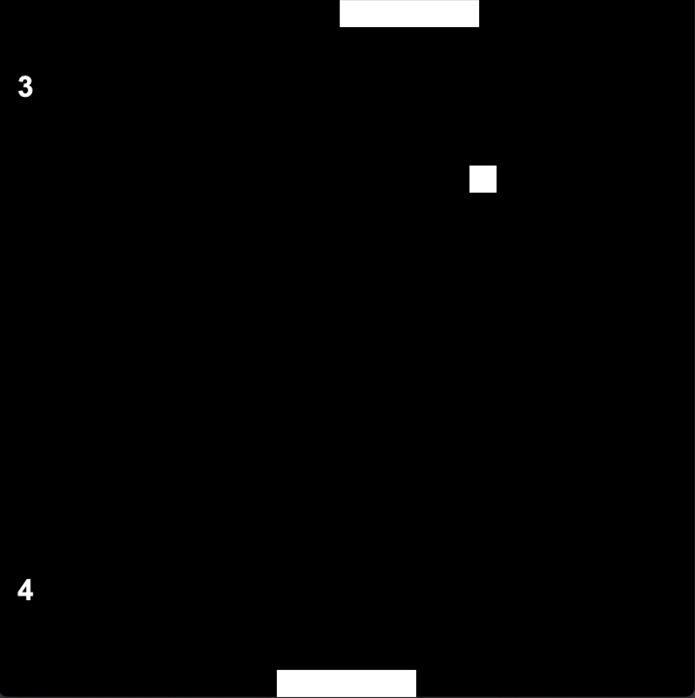

# 🏓 Pong — Versão Java

Este é um clone simples (e viciante 😏) do clássico **Pong**, feito em **Java**.  
O objetivo é bem direto: **não deixe a bola passar!**

---

## 🎮 Como funciona
- Você controla a barra de baixo (`Player`).
- O inimigo (`Enemy`) fica na parte de cima, tentando devolver a bola.
- A bola (`Ball`) quica nas paredes e barras, ficando cada vez mais imprevisível.
- Quem deixar a bola passar, perde o ponto.  

---

## ⌨️ Controles
- Pressione **A ou Seta Esquerda ←** para mover para a esquerda  
- Pressione **D ou Seta Direita →** para mover para a direita  

Simples assim!  

---

## 🚀 Como rodar
1. Certifique-se de ter o **Java 17+** instalado.  
2. Compile o jogo:
   ```bash
   javac -d game src/*.java
   ```
3. Crie o `.jar`:
   ```bash
   jar cfe Pong.jar Game -C game .
   ```
4. Execute:
    ```bash
    java -jar Pong.jar
    ```

---

## ✨ Funcionalidades
- Jogabilidade simples e nostálgica 🕹️
- Inimigo controlado por **IA** (boa sorte em vencê-lo 😅)
- Animações suaves com **Java AWT**

---

## 📷 Screenshots



---

## 🧑‍💻 Sobre o projeto
Feito como exercício de programação em **Java** e para relembrar um dos maiores clássicos da história dos games.

Ideal para aprender:
- Estrutura de jogos em loop;
- Detecção de **colisões**;
- Controle de input;
- Simples **IA** de inimigo.

---

## ❤️ Créditos
Desenvolvido por **Enrico Sobrinho Gregório**.
Se você também passou horas jogando Pong, esse projeto **é para você!** 🎉